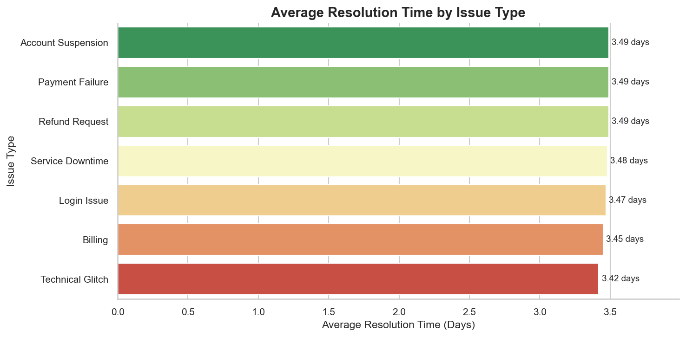
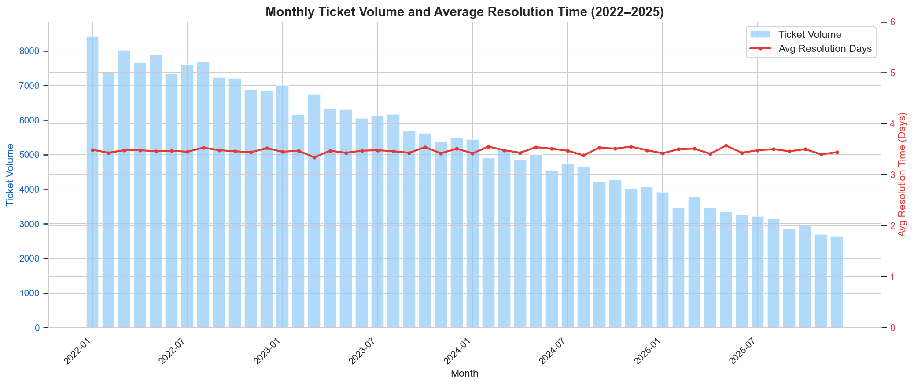
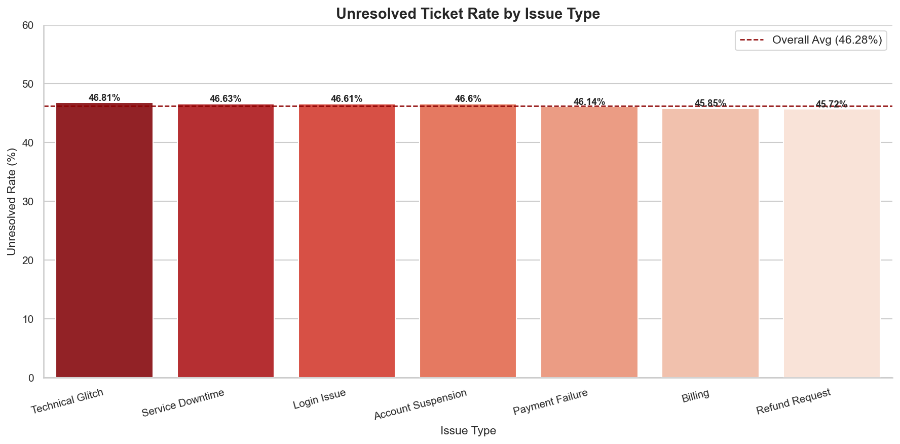

# 📊 Customer Service Root Cause Analysis
### Domain: Fintech / Payments | Tools: Python · SQL Server · Seaborn · Matplotlib

---

## 📌 Business Problem

A fintech company's customer service department was experiencing 
delays in resolution time and declining customer satisfaction, 
but the root causes were unknown.

> *"Is this an agent problem? A regional problem? A channel problem?
> Or something deeper?"*

This project uses 4 years of customer service ticket data to answer
that question with evidence.

---

## 🎯 Objective

Identify the key drivers of poor resolution time and low customer
satisfaction scores across issue type, agent, channel, and region —
and provide actionable recommendations to fix them.

---

## 📂 Dataset

| Property | Detail |
|---|---|
| Source | Internal customer service ticket records |
| Raw Size | 400,000 rows × 11 columns |
| Clean Size | 257,807 rows × 11 columns |
| Period | January 2022 — January 2026 |
| Domain | Fintech / Payments (Nigeria) |


**Columns:**
`ticket_id` · `customer_id` · `issue_type` · `channel` · `created_at`
· `resolved_at` · `response_time_minutes` · `resolution_time_minutes`
· `customer_satisfaction` · `agent_name` · `region`

---

## 🛠️ Tools & Stack

| Tool | Purpose |
|---|---|
| Python (Pandas, NumPy) | Data cleaning & feature engineering |
| SQL Server (SSMS) | Deep-dive analysis queries |
| Seaborn & Matplotlib | Data visualization |
| Scikit-learn | Logistic regression & correlation analysis |
| Jupyter Notebook | End-to-end documentation |
| GitHub | Version control & portfolio hosting |

---

## 🔍 Project Structure

```
customer-service-root-cause-analysis/
│
├── data/
│   ├── customer_service_uncleaned_400k.csv
│   └── customer_service_cleaned.csv
│
├── notebook/
│   └── customer_service_root_cause_analysis.ipynb
│
├── charts/
│   ├── chart1_resolution_time_by_issue.png
│   ├── chart2_csat_distribution_by_issue.png
│   ├── chart3_unresolved_rate_by_issue.png
│   ├── chart4_monthly_trend.png
│   └── chart5_csat_channel_region.png
│
└── README.md
```

---

## 📊 Analysis Phases

### Phase 1 — Data Inspection
Examined data types, missing values, and descriptive statistics
to understand the full extent of data quality issues before cleaning.

### Phase 2 — Data Cleaning
Systematically addressed 8 data quality issues including sentinel
values, impossible date logic, invalid scores, and inconsistent
casing. Reduced dataset from 400,000 to 257,807 clean records.

### Phase 3 — SQL Analysis
Loaded clean data into SQL Server and ran 5 targeted queries to
answer specific business questions about resolution time, CSAT,
unresolved tickets, trends, and channel performance.

### Phase 4 — Descriptive Visualizations
Built 5 charts using Seaborn and Matplotlib to visualize patterns
across issue type, channel, region, agent, and time.

### Phase 5 — Diagnostic Analysis
Applied correlation analysis and logistic regression to identify
drivers of low CSAT and unresolved tickets.

---

## 🔑 Key Findings

| Finding | Result |
|---|---|
| Average resolution time | 3.46 days across all categories |
| Unresolved ticket rate | 46.28% of all tickets never closed |
| Low CSAT rate (scores 1–2) | ~40% across all agents and regions |
| Resolution time trend (4 years) | Completely flat — zero improvement |
| Volume decline (2022–2025) | 69% drop with no efficiency gain |
| Variation across agents | Negligible — all score 2.98–3.00 |
| Variation across regions | Negligible — all score 2.99–3.00 |
| Variation across channels | Negligible — all score 2.99–3.00 |
| Variation across issue types | Negligible — all average 3.42–3.49 days |

---

## 💡 The Core Insight

> *Ticket volume dropped by 69% over 4 years but resolution time
> never improved by a single day. No agent, region, channel or
> issue type stood out as significantly better or worse than any
> other. The problem is not a people problem, a location problem,
> or a channel problem.*
>
> ***It is a process problem.***

---

## ✅ Recommendations

| Priority | Recommendation |
|---|---|
| 🔴 Critical | Redesign the end-to-end ticket resolution process |
| 🔴 Critical | Audit and clear the 46% unresolved ticket backlog |
| 🟠 High | Invest in chat channel capacity (handles 2× the volume) |
| 🟠 High | Fast-track Payment Failure and Account Suspension tickets |
| 🟡 Medium | Fix upstream data collection to capture timestamps accurately |

---

## 📈 Sample Visualizations

### Average Resolution Time by Issue Type


### Monthly Ticket Volume vs Resolution Time Trend


### Unresolved Ticket Rate by Issue Type


---

## 👤 Author

**John Kingsley Emeka**
Data Analyst | Customer Service Professional
📍 Lagos, Nigeria
🔗 [GitHub](https://github.com/JK-Analytics)

---

## 📬 Feedback

If you found this project useful or have suggestions,
feel free to open an issue or connect with me on LinkedIn.
